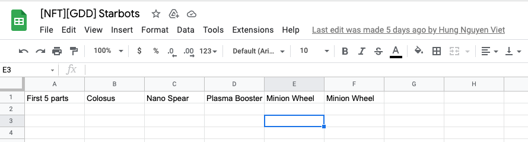

## Requirement

- If users have registered or had game account:

  - users login gameplay, users are provided a lot of woody parts in Inventory

- Wood is the lowest tier => should be tier: 0
- Tất cả feature của Part đều apply vào Wood Part trừ feature Upgrade !!!

* Chưa có stat cho những part free này

## Requirement techniques

- Đảm bảo tất cả User đã có tài khoản, với mỗi account phải có 5 parts gỗ default. Có thể viết code để generate ra Query init records cho toàn bộ User tính tời thời điểm run query. Lưu chung những parts này vào bảng Asset

- Đảm bảo logic khi User đăng ký tài khoản mới sẽ mặc định có 5 parts gỗ default

-> nhân đây refactor lại bảng Global Asset, lưu bot_index và attached_slot ra 1 bảng riêng bên Game Service, tránh lưu thông tin không cần thiết ở bảng Global. Dễ cho việc query và debug

- Cần đảm bảo rằng Tier = 0 (part woody) thì sẽ không call được API Upgrade

## GRAPHQL TYPE

## GRAPHQL QUERY

## GRAPHQL MUTATION

## DATABASE SCHEMA
