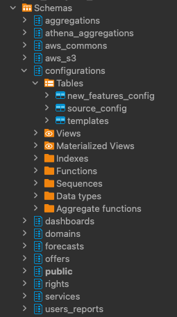

# Refactor code Part Module for Game Service

## Tổ chức lại Module Parts thành 2 phần:

- Parts-info
- Parts-charge-station

### Design lại DB:

- Refactor bảng **game_asset** trong DB Game-graph thành **part_battery** bao gồm các cột như sau:

  - id
  - asset_id
  - batteries
  - start_time
  - is_charge
  - is_on_dock

- Cần thêm 1 bảng **charge_charge_slot_management** trong DB Game-graph thuộc bound-context của Parts-charge-station module, bao gồm các cột như sau:

  - id
  - user_id
  - part_battery_id (link từ id của bảng part_battery)
  - slot_index: [] (bao gồm các index: 0, 1, 2. Default là [])

- Cần thêm logic cho Charge Station Slot management:

  - Mỗi User hiện tại chỉ được Charge 1 Body (1 slot) tại 1 thời điểm (sau này có thể mở rộng thêm nhiều slots)
    => Draft solution:
    - Thêm 1 bảng charge_slot_management trong database (note bên trên)
    - Có thể join bảng part_battery với bảng charge_slot_management để quản lý số lượng part được charge tại 1 thời điểm

- Cần thêm 1 bảng để lưu lại những **Robot** mà User đó đang lắp, tách biệt ra khỏi bảng Asset ở Asset Service (rất khó quản lý và validate). Bảng **robot_stand_in** này sẽ có các cột như sau:

  - id
  - user_id
  - bot_index (là 1 trong các giá trị sau đây: 0, 1, 2)
  - robot_info: [
    {
    asset_id: ...,
    attached_slot: ...
    }, ...
    ]

- Cần thêm 1 schema mới: configurations. Bên trong schema này, trước mắt sẽ có table: part_battery. Design như sau:

  - id
  - type
  - sub_type
  - tier
  - default_battery
  - slot_range (sau này mint part mới, random sẽ được dựa theo ratio đc base ở config này, Admin có thể tinh chỉnh dễ dàng hơn)
  - energy_range
  - power_range
  - health_range
  - attack_range
    ...

   Example: 

### Design lại resolver:

- Resolver Parts-info:

  Query:

  - part
  - partsByUser => cần modify lại, keep up to date
  - nextLevelPartStat
  - syncPartsStatus

  Mutation:

  - updateInventory => cần modify lại base trên DB design mới bên trên
  - upgradePartLevel => cần xem lại logic, hiện tại đang fix cứng cost upgrade trên server codebase
  - syncParts

- Resolver Parts-charge-station:
  Mutation:
  - updateStatusPartAtDock
  - chargeBodyPart => cần modify lại, keep up to date
  - unplugBodyPart => cần modify lại, keep up to date
